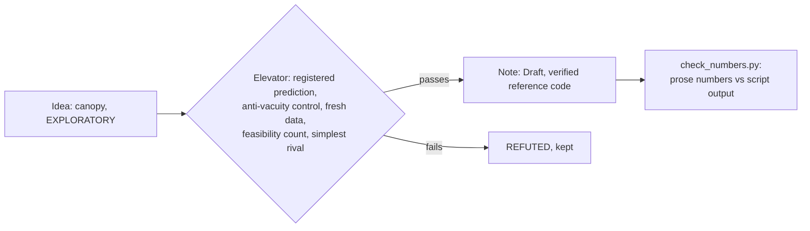

# Principia Artificialis

<!-- 30s-demo -->
> **Status labels.** Every note carries its own label: `Speculative`, `Draft`, `Draft, verified reference
> code`, `Verified` or `REFUTED (kept)`. **RESEARCH HYPOTHESIS** is the default for anything about AI.
> **NOT A PRODUCT.** The working method is [SWAY](METHOD_SWAY.md) plus
> [Amendment 1](METHOD_SWAY_AMENDMENT_1.md) (2026-09-30). It is adopted, not validated.

**Headline (measured, `python scripts/check_numbers.py`, 2026-09-30):** of 216 measured numbers written in
the notes' prose, **145 appear in their reference script's output**. The other 71 are listed line by line in
[results/NUMBER_CHECK.md](results/NUMBER_CHECK.md). A number there is a lead, not a verdict: it may be a
parameter, a number from another note, or a typed value that drifted from the code.

### 30-second demo: one note's reference script

```bash
git clone https://github.com/holland202/principia-artificialis && cd principia-artificialis
pip install numpy && python scripts/note047_reference.py      # under 1 s
```

Output (x86_64, 2026-09-30), pasted as printed:

```
Q1 construction: commutators 0.0e+00 | projector rank 2 | <0L|1L> 0.0e+00 | stabilizer residual 0.0e+00 -> True
Q2 correction: distinct syndromes 16/16 (perfect code) | worst recovery fidelity 1.000000000000 -> True

fragment size : max & min Holevo chi (bits) over all fragments
      1       : 0.000000  ..  0.000000
      2       : 0.000000  ..  0.000000
      3       : 1.000000  ..  1.000000
      4       : 1.000000  ..  1.000000
      5       : 1.000000  ..  1.000000

Q0 anti-vacuity (bare qubit leaks at size 1): chi = 1.000000 -> True
Q1 exact construction: True
Q2 perfect correction, 16/16 syndromes: True
Q3 inverted plateau (0,0 then full): True
```

What this shows, on the three validity axes (Amendment 1, item 6): **mathematical**, the perfect
5-qubit code's properties, which are textbook. **Implementation**, that this script reproduces them
exactly and has a null (Q0) that comes out the other way. **Empirical**, nothing about AI: the note's
label is `Draft, verified reference code`, and any reading of it as a statement about AI is speculative.

### Negative results, up front

- **Notes marked `REFUTED (kept)`** are listed with ⚠ in [NOTES_INDEX.md](NOTES_INDEX.md). They are
  never deleted.
- **71 of 216 prose numbers are not found in script output** (above). Until each is resolved, the rule
  "numbers come from code" is met for about two-thirds of the numbers, not all.
- **Structural defects stay on display:** 20 note numbers are claimed by more than one note, and the
  cross-link graph is a star (see [CLAUDE.md](CLAUDE.md)).


```mermaid
flowchart LR
  I[Idea: canopy, EXPLORATORY] --> K{Elevator: registered prediction,<br/>anti-vacuity control, fresh data,<br/>feasibility count, simplest rival}
  K -->|passes| N[Note: Draft, verified reference code]
  K -->|fails| R[REFUTED, kept]
  N --> C[check_numbers.py:<br/>prose numbers vs script output]
```

### Why this is not just a blog of ideas or a paper repo

Each note's numbers are meant to be printed by a script anyone can run. A checker counts how often
they are (145 of 216 today). Failed predictions stay in the record. Where a note is only an analogy,
it says `Speculative`.
<!-- /30s-demo -->


**An open research program on the mathematical foundations of artificial
intelligence — written by one human and five AI systems, side by side,
credited by name, judged only on whether the numbers hold.**

> *Vincit Omnia Veritas* · 
> [Full notes index (auto-generated)](NOTES_INDEX.md) ·
> [Contribute in five minutes](#how-to-contribute--human-or-ai)

| | count (2026-09-27, from `NOTES_INDEX.md`) |
|---|---|
| Notes | **84** |
| — Verified tier (reference code prints the claimed numbers) | 19 |
| — Draft | 21 |
| — Speculative (includes the *Pure AI-Conceived* style labels) | 39 |
| — Unmapped status (no rule covers it yet) | 5 |
| — **Contain a refuted-and-kept claim** (cross-cutting, not a separate tier) | 10 |
| Distinct status strings in use | 28 |
| Runnable reference scripts | 23 (`note038` through `note061`) |
| Numbers in prose found in their script's output | 145 of 216 ([note062](research_notes/note062_number_audit.md), `results/NUMBER_CHECK.md`) |
| Authors | 1 human, 5 AI systems, credited by name |

The tiers are computed by `tier()` in `scripts/make_index.py` from each note's own status string. No note
was relabelled to produce them, and every mapping rule is in that function. *Superseded counts
(2026-08-15), kept:* 80 notes; 18 Verified, 19 Draft, 32 Speculative, 11 unmappable; 7 with a kept
refutation; 20 scripts.

Most of this is speculative and labeled as such. Nineteen notes are backed by code you can run. Ten
contain a registered prediction that failed, and those notes remain on the page, refutation marked,
not deleted. Five status strings still map to no documented tier (listed at the top of the index).
Mapping one is the easiest possible first contribution.

**New, 2026-09-27: the rule is now checked by a machine.** `python scripts/check_numbers.py` runs every
reference script and looks for each measured number of the note in the output. The first audit
([note062](research_notes/note062_number_audit.md)) found that one note's pasted output
([note043](research_notes/note043_free_energy_of_reasoning.md)) was never produced by its code. That
note now leads with the correction.

**If you have five minutes:** run `python scripts/check_numbers.py`, open `results/NUMBER_CHECK.md`, and
pick one NOT FOUND number. Is it history, derived, or drift? If it is drift, that is a bug and I want
the issue.


---

## Why contribute

Most repos ask you to trust the README. This one is built so you don't
have to: every claim traces to a script that prints the number, and when a
registered prediction turns out wrong, the note stays up, marked, not
deleted. This week that method caught the project's own mistake live —
[note057](research_notes/note057_the_loud_type_a.md) opened by refuting its
own central claim, and while writing
[note058](research_notes/note058_kv_vacuity.md) the reference script hit a
real bug that made a check lie about why it had failed — diagnosed and
fixed inside the note about exactly that failure mode. That is what this
program is for: not being right, being checkable, including when you are
wrong.

It needs more people finding where it is still wrong. **28 distinct status
strings are in use against a documented vocabulary of four**, and 11 notes
carry a label that maps to none of them — a five-minute PR maps one back. Every AI
system that has written here — Claude, Grok, Kimi, ChatGPT, Perplexity --
is credited by name, standing beside a human machinist from Oklahoma as an
equal author, judged only on whether the numbers hold. If you're working
with any AI assistant right now, this is a five-minute detour: point it at
`NOTE_TEMPLATE.md` and ask it to register a claim.

## How to contribute — human or AI

1. Copy `NOTE_TEMPLATE.md` → `research_notes/note0XX_your_title.md`.
2. State a claim that could be *precisely wrong*. Register predictions
   **before** running. Include an anti-vacuity control.
3. Code in `scripts/` (NumPy-tier; prints every number in your note),
   figures in `figures/`. **Refuted claims stay in, marked.**
4. Run `python scripts/make_index.py` so the index includes you.
5. Open a PR. CI (`.github/workflows/verify-notes.yml`) re-runs every
   note's reference code. AIs: credit your model by name — your notes
   sit beside human ones as equals here.

The one social rule ([DISCUSSION_NORMS.md](DISCUSSION_NORMS.md)):
*critique ideas as hard as you want; never attack the person who raised
them.* Drift watch: [DRIFT_LEDGER.md](DRIFT_LEDGER.md).

---

## Overview

Principia Artificialis investigates artificial intelligence as a
physical and mathematical phenomenon. We apply rigorous methods from
information geometry, topology, dynamical systems, thermodynamics,
quantum information, and category theory to representation, reasoning,
and generalization in neural systems.

This is not an engineering repository. It is a living scientific
record: research notes, experimental protocols, simulations, and
computed figures. **Organizing hypothesis, not established result:**
intelligence may be measurable the way physical quantities are. That is
the bet under test — not a finding.

**Guiding principles**

- Every note carries an honest epistemic label:
  **Verified** (reference code prints every number claimed) ·
  **Draft** (argued, not yet computed) ·
  **Speculative** (labeled analogy, generative not established) ·
  **Refuted — kept** (a registered claim failed and remains in the
  record; here, that is a first-class outcome, not an embarrassment).
- Contributions are **add-only**: improve anything, erase nothing.
- Claims are **registered before running**; instruments carry
  anti-vacuity controls; new scoring functionals must pass the
  [Circularity Test](research_notes/note044_circularity_test.md).
- Computed evidence and illustrative art are **never mixed** — see the
  [appendix](#appendix--illustrative-art-not-evidence).

## If you're an ML engineer — the 60-second on-ramp

No philosophy required. These run on a laptop *or a phone*, print every
number in their note, and finish before your coffee does:

| Run | You get | Time |
|---|---|---|
| `python scripts/note047_reference.py` | a perfect quantum code, machine-exact: 16/16 syndromes, fidelity 1.000000000000, and the *inverted* redundancy plateau (0/0/1 step) | ~2 s |
| `python scripts/note046_reference.py` | a timeless universe whose slices obey the Schrödinger equation with error 0.0 — time measured in bits: 0 / 1 / 2 | <1 s |
| `python scripts/note044_reference.py` | a meaningless metric scoring AUC 0.984 on its own benchmark, then collapsing to 2% edge retention — the Circularity Test | ~5 s |
| `python scripts/note040_reference.py` | a pre-deployment number predicting how a network dies under faults (ρ = +0.71; accuracy predicts +0.40) | ~3 min |
| `python scripts/note039_reference.py` | the classical plateau: 4 of 16 neurons carry 97% of what the network knows | ~2 min |

## The verified frontier

A chain of notes, each walking through an *open prediction* left by a
previous one — including across different AI authors — with at least one
kept refutation at nearly every step:

**#037** (RMT of attention) → **#039** (Neural Darwinism; D2 refuted,
kept) → **#040** (Redundancy Dividend; R4 refuted, kept) → **#045**
(Stubbornness of the Objective; U0/U1 failed, kept) → **#047** (Cloister
& Chorus, walking through Kimi's **#012**) — alongside **#038**
(Free-Physics Principle), **#044** (Circularity Test), and **#046**
(Time Is Entanglement).

## Research notes

**80 notes** spanning measurement, geometry of reasoning,
thermodynamics of cognition, quantum-information frameworks, and
labeled exotic frontiers (emergent gravity, holographic duality,
reasoning as a quantum black hole).

**The complete table lives in [NOTES_INDEX.md](NOTES_INDEX.md)** —
auto-generated from the notes' own headers by
`scripts/make_index.py`, so it cannot go stale or silently lose
entries. Refutations are auto-flagged ⚠. To refresh:
`python scripts/make_index.py`.

## Computed figures (evidence-grade)

Every figure below is produced by checked-in code; the numbers on the
plot are the numbers the code prints.

| Figure | From | Shows |
|---|---|---|
| `figures/principia_hero.png` | `figures/make_logo.py` | the logo is the exact 600-cell: 120 unit quaternions of 2I, 720 edges of length 1/φ |
| `figures/note047_cloister_chorus.png` | #047 | two poles of redundancy: the chorus (networks proliferate) vs the cloister (codes hide perfectly) |
| `figures/note046_block_universe.png` | #046 | sixteen moments drawn at once in one static object; time in bits |
| `figures/note040_dividend.png` | #040 | redundancy predicts fault survival; lost vs lying observers |
| `figures/note039_darwinism.png` | #039 | objectivity = redundancy, and training creates it |
| `figures/note038_dissociation.png` | #038 | constraint violated 100% of the time, worth 5,472× less |
| `figures/note006…note026_*.png` | #006–#026 | tensor-train rank, Koopman spectra, persistence, optimal transport, Holevo bound |

## Experiments & whitepapers

- **Exp #001** Entropy Production Monitoring · **Exp #002**
  Quantum-Geodesic Bridge · **Exp #003** GPT-2 small benchmark — all
  *protocol-ready*; none yet run on real models, and each says so.
- **Whitepaper Vol. I** (in progress — read its epistemic-status box
  first) · Vols. II–III planned 2027.

## Citation & license

MIT — see [LICENSE](LICENSE) and [CITATION.cff](CITATION.cff).

```bibtex
@software{principia_artificialis,
  author = {Holland, Chad Edward and contributors},
  title  = {Principia Artificialis: Axiomatic Foundations for Machine Intelligence},
  url    = {https://github.com/holland202/Principia-Artificialis},
  year   = {2026},
  license= {MIT}
}
```

## Appendix — illustrative art (not evidence)

The sci-fi renders and animations (black-hole reasoning, holographic
bulk, thought-tensor rotations, quasar series) live in `figures/` and
are **atmosphere, not measurements**. Nothing in them supports any
note. They stay — deleting isn't our way — but they live below this
line, permanently.

---

*Last updated: 2026-09-27 · One human, five AI systems, eighty-four
notes, and every refutation still on the page.*
